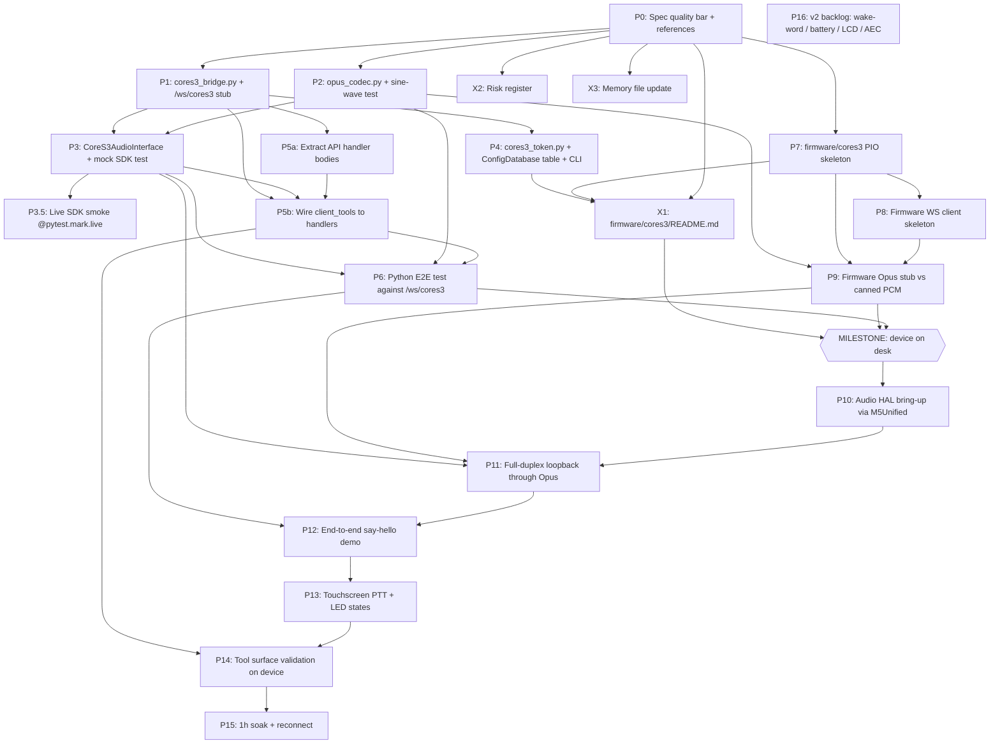

# CoreS3 Port — Phased Implementation Plan

**You are reading this on:** 2026-06-02 (revised same day after spec↔plan review)
**Spec:** `/Users/jakubsikora/Repos/personal/walkie-talkie/thoughts/shared/research/2026-06-01-cores3-port-spec.md`
**Review:** `/Users/jakubsikora/Repos/personal/walkie-talkie/thoughts/shared/research/2026-06-02-cores3-spec-plan-review.md`
**Status:** Pre-device. M5Stack CoreS3 hardware not yet on desk. All pre-device phases (P0–P9, P3.5, P5a/b, X1–X3) must produce code, fixtures, or docs that compile/run without the device. Phases P10+ are gated on `MILESTONE: device on desk` and MUST NOT begin until the unit is physically in hand. The plan ports the iPad/Safari client to an M5Stack CoreS3 talking to the existing Python FastAPI backend via a new WebSocket bridge that re-frames Opus binary audio into the ElevenLabs Python SDK `AudioInterface` contract [spec §3, §6]. The Python server stays put; only one new endpoint, one bridge module, one Opus wrapper, one device-token store, and a new top-level `firmware/cores3/` PlatformIO project get added.

**Revision history:**
- 2026-06-02 v1: Initial plan from spec.
- 2026-06-02 v2: After spec↔plan review (`2026-06-02-cores3-spec-plan-review.md`). Removed the `0xFF` binary sentinel (collides with valid Opus TOC bytes — spec §12.X gap #4); locked partial-frame handling to zero-pad (spec §12.X gap #2); split P5 into P5a (refactor) + P5b (wire); added P3.5 live-SDK smoke test; corrected effort math (pre-device 13.50 d, post-device v1 10.50 d, P16 deferred 4 d); clarified RQ-3 AEC is only partially reduced by PTT and carries to P16.

---

## Milestone Gate

```
============================================================
MILESTONE: device on desk
------------------------------------------------------------
DO NOT start any task in section "Post-device phases" (P10+)
until the M5Stack CoreS3 unit is physically connected to a
USB-C cable on the developer machine, `pio device list` shows
the m5stack-cores3 USB-CDC port, and `M5.begin()` from a
trivial sketch logs to the serial monitor at 115200 baud.
============================================================
```

---

## Dependency Graph



P3.5 is opt-in (no downstream consumer) and P16 is explicitly deferred from the v1 critical path — neither is drawn into the MS gate.

---

## Effort Summary

- **Pre-device total (P0–P9, X1–X3):** 13.50 dev-days
  - P0:0.5, P1:1.5, P2:0.5, P3:1.5, P3.5:0.25, P4:1.0, P5a:0.5, P5b:1.5, P6:1.5, P7:0.5, P8:1.5, P9:1.5, X1:0.5, X2:0.5, X3:0.25
- **Post-device v1 (P10–P15, P16 excluded):** 10.50 dev-days
  - P10:1.5, P11:2, P12:1.5, P13:1.5, P14:2, P15:2
- **Deferred backlog (P16, NOT in v1 critical path):** 4 dev-days
  - Wake-word, battery profiling, on-device LCD UI, AEC evaluation. Tracked separately so it does not inflate the v1 estimate.
- **Grand total v1:** 24 dev-days (sized for one engineer, including integration friction). With the P16 backlog: 28 dev-days.

---

## Pre-Device Phases

### P0 — Spec Quality Bar and Reference Material

**Why:** Every subsequent task assumes the planner and any subagent has read the spec, the ElatoAI reference repo, and the ESPHome CoreS3 config. Without this baseline, P1–P9 tasks will hallucinate audio chain details. [spec §11]

**Files touched/created:**
- *Create* `/Users/jakubsikora/Repos/personal/walkie-talkie/firmware/cores3/references/READING_LIST.md` — links to spec §11 sources [#1, #2, #3, #4, #6, #8, #11, #12], with one-line gloss per link.
- *Create* `/Users/jakubsikora/Repos/personal/walkie-talkie/firmware/cores3/references/elatoai/` — git-clone of `https://github.com/akdeb/ElatoAI` at the SHA the spec references, plus a short `NOTES.md` summarising the FreeRTOS task split, the WSS Opus framing, and the `platformio.ini` choices we are copying [spec §11].
- *Create* `/Users/jakubsikora/Repos/personal/walkie-talkie/firmware/cores3/references/esphome-m5cores3.yaml` — copy of `m5stack/M5CoreS3-Esphome` ESPHome YAML config; this is the authoritative GPIO + AXP2101 rail reference [spec §2, §11].
- *Create* `/Users/jakubsikora/Repos/personal/walkie-talkie/firmware/cores3/references/esp32s3-i2s-duplex.md` — distilled notes on shared-BCK/WCK duplex pattern from ESP-IDF I2S docs [spec §12 RQ-1].

**Acceptance criteria:**
- `READING_LIST.md` lists at minimum: spec §15 sources #1, #2, #3, #4, #5, #6, #8, #9, #11, #12, #16, #19.
- `references/elatoai/` clone has its commit SHA pinned in a `COMMIT.txt` sibling file.
- ESPHome YAML is present, not modified, and its source URL is at the top of the file in a comment.
- A reviewer can read all four files in under 30 minutes and answer: what bitrate, what sample rate, which GPIOs, which task pinning.

**Tests required:** None (documentation phase). A reviewer checklist counts.

**Estimated effort:** S (0.5 day)

**Depends on:** —

---

### P1 — Server: `walkie_agent/cores3_bridge.py` + `/ws/cores3` WebSocket Endpoint Skeleton

**Why:** The bridge is the single point that swaps the browser's role. Building the WebSocket handshake, the wire protocol message handling, and the session lifecycle [spec §5] with stubbed audio first lets every later piece slot in. [spec §6.1, §6.2]

**Files touched/created:**
- *Create* `/Users/jakubsikora/Repos/personal/walkie-talkie/project/walkie_agent/cores3_bridge.py` — module containing:
  - `CoreS3Session` dataclass: connection-scoped state (device record, current character, `_running` flag, audio interface instance, current `Conversation`).
  - `async def cores3_session_handler(websocket, device_record, db, settings)` — the coroutine implementing the §5 state machine.
  - `class CoreS3AudioInterface(AsyncAudioInterface)` — `start`/`stop`/`output`/`interrupt` stubs that just log; real implementation lands in P3.
  - JSON schema validators for all §5 control message types: `session_start`, `session_end`, `switch_character`, `set_volume`, `keepalive`; outbound: `hello`, `session_started`, `session_ended`, `tool_event`, `volume_ack`, `error`, `keepalive_ack`.
- *Touch* `/Users/jakubsikora/Repos/personal/walkie-talkie/project/walkie_agent/api.py` — add the new endpoint:
  ```python
  @app.websocket("/ws/cores3")
  async def cores3_ws(websocket: WebSocket, device_token: str = Query(...)):
      ...
  ```
  alongside the existing `/ws/walkie-talkie/{client_id}` endpoint at the same router scope; the endpoint must call into `cores3_bridge.cores3_session_handler`.
- *Touch* `/Users/jakubsikora/Repos/personal/walkie-talkie/project/walkie_agent/api.py` — import `from walkie_agent.cores3_bridge import cores3_session_handler` near other imports around the top of the file.
- *Touch* `/Users/jakubsikora/Repos/personal/walkie-talkie/project/pyproject.toml` (or equivalent dep manifest) — add `elevenlabs>=1.0,<2.0` if not already pinned tightly [spec §12 RQ-2], add `pytest-asyncio`, `websockets` to dev deps.

**Acceptance criteria:**
- `uvicorn walkie_agent.api:app` boots cleanly with the new endpoint registered (visible in OpenAPI schema or startup log).
- Connecting to `ws://localhost:8000/ws/cores3?device_token=stub` with a junk token returns HTTP 401 *before* the upgrade completes (handled in P4; for now this can return a stubbed `error` JSON then close). When P4 lands the real check is wired in.
- Sending `{"type":"session_start","ts":...}` causes the server to log "session_start received" and respond with a `session_started` frame containing a fake `conversation_id` and the current character.
- Sending `{"type":"keepalive","ts":...}` causes a `keepalive_ack` reply within 50 ms.
- Sending malformed JSON or unknown `type` causes one `error` frame with `code` from the §5 enum and does not crash the coroutine.
- No real ElevenLabs SDK is contacted; the stub `CoreS3AudioInterface` is registered and its method calls are logged.

**Tests required:**
- New file `/Users/jakubsikora/Repos/personal/walkie-talkie/project/walkie_agent/tests/test_cores3_bridge_protocol.py`:
  - `test_hello_on_connect` — connect via `pytest-asyncio` + `websockets`, assert first message is a `hello` text frame whose JSON matches the §5 schema and includes all 11 character ids [spec §5 hello example].
  - `test_keepalive_round_trip` — send `keepalive`, expect `keepalive_ack`.
  - `test_session_start_session_end_pair` — send both, expect `session_started` then `session_ended`.
  - `test_unknown_message_returns_error` — send `{"type":"frobnicate"}`, expect single `error` frame, connection stays open.
  - `test_switch_character_valid_and_invalid` — valid id (e.g. `steve`) accepted; junk (e.g. `barney`) returns `error`.

**Estimated effort:** M (1.5 days)

**Depends on:** P0

---

### P2 — Server: Opus Codec Wrapper `walkie_agent/opus_codec.py`

**Why:** All audio between device and bridge is Opus on the wire and PCM in memory. A small, testable wrapper keeps the bridge clean and isolates a brittle ctypes dependency. [spec §6.3, §4]

**Files touched/created:**
- *Create* `/Users/jakubsikora/Repos/personal/walkie-talkie/project/walkie_agent/opus_codec.py`:
  - `OPUS_SAMPLE_RATE = 16000`, `OPUS_CHANNELS = 1`, `OPUS_FRAME_MS = 20`, `OPUS_FRAME_SAMPLES = 320`, `OPUS_BITRATE = 16000` constants (locked per [spec §4]).
  - `class OpusEncoder` wrapping `opuslib.Encoder(sample_rate=16000, channels=1, application=opuslib.APPLICATION_VOIP)`, exposing `encode(pcm_bytes: bytes) -> bytes`. Input length asserted == 640 bytes.
  - `class OpusDecoder` wrapping `opuslib.Decoder(16000, 1)`, exposing `decode(opus_bytes: bytes) -> bytes`. Output length asserted == 640 bytes.
  - Module-level `encode_pcm_stream(pcm: bytes) -> list[bytes]` and `decode_packet_list(packets: list[bytes]) -> bytes` helpers used by tests.
- *Touch* `/Users/jakubsikora/Repos/personal/walkie-talkie/project/pyproject.toml` — add `opuslib>=3.0` runtime dep. Document system dep `libopus` in a comment.

**Acceptance criteria:**
- `python -c "from walkie_agent.opus_codec import OpusEncoder, OpusDecoder"` works without error on Mac (Homebrew `libopus`) and on the project's deploy host (Mac Studio per memory note).
- Encoder rejects non-640-byte input with `ValueError`.
- Decoder produces exactly 640 bytes for every well-formed input.

**Tests required:**
- `/Users/jakubsikora/Repos/personal/walkie-talkie/project/walkie_agent/tests/test_opus_codec.py`:
  - `test_sine_wave_round_trip` — generate a 1-second 440 Hz sine wave at 16 kHz mono int16 PCM (numpy `np.sin`), slice into 320-sample frames, encode, decode, concatenate. Assert (a) reconstructed length matches input length, (b) per-sample RMS error against the original sine is below 15% of sine amplitude (Opus VoIP at 16 kbps is lossy but preserves a clean tone within that bound).
  - `test_packet_sizes_within_voip_envelope` — assert every encoded packet is between 20 and 80 bytes (typical for 16 kbps, 20 ms VoIP).
  - `test_silence_compresses` — 1 s of zeros encodes to packets averaging < 15 bytes (DTX / very low entropy expectation).
  - `test_encoder_rejects_wrong_frame_size` — `pytest.raises(ValueError)`.

**Estimated effort:** S (0.5 day)

**Depends on:** P0

---

### P3 — Server: `CoreS3AudioInterface` Real Implementation + Mock-Backed Unit Tests

**Why:** This is the contract glue between the ElevenLabs Python SDK and our WebSocket. If this class is wrong, every downstream phase fails silently. [spec §6.1, §12 RQ-2]

**Files touched/created:**
- *Touch* `/Users/jakubsikora/Repos/personal/walkie-talkie/project/walkie_agent/cores3_bridge.py`:
  - Replace the stub `CoreS3AudioInterface` from P1 with a real subclass of `elevenlabs.conversational_ai.conversation.AsyncAudioInterface` implementing:
    - `async def start(self, input_callback)`: stores callback; sets `self._running = True`. Creates an `OpusEncoder` (for outbound TTS) and `OpusDecoder` (for inbound mic) per session [spec §6.3]. Decoder is keyed to mic stream from device; encoder to TTS stream going back.
    - Wait — clarification: the *encoder* is needed for PCM-from-EL → Opus-to-device. The *decoder* is needed for Opus-from-device → PCM-to-EL. The decoder lives in the WS recv path of the session handler, NOT inside the interface. The interface owns the encoder only. Update implementation accordingly.
    - `async def output(self, audio: bytes)`: chunks `audio` (250 ms typical from SDK per [spec §4]) into 320-sample (640-byte) frames; encodes each with the per-session encoder; `await websocket.send_bytes(opus_packet)` for each frame. If `websocket.client_state != CONNECTED`, drop and set `self._dropped += 1`.
    - `async def interrupt(self)`: send a single text frame `{"type":"agent_interrupted","ts":<now>}`. **Do NOT also send a 1-byte `0xFF` binary frame** — a valid Opus packet can legally begin with `0xFF`, so a length-1 binary frame is indistinguishable from a malformed Opus packet. The text frame is the sole interrupt signal, per [spec §6.1] and [spec §12.X gap #4].
    - `async def stop(self)`: sets `_running = False`; closes encoder.
  - The session handler's recv loop creates one `OpusDecoder` per `session_start` and uses it to turn every inbound binary frame into PCM, then calls the stored `input_callback(pcm_bytes)` from the SDK.
- *Touch* `/Users/jakubsikora/Repos/personal/walkie-talkie/project/walkie_agent/tests/test_cores3_bridge_protocol.py` — minor: expand to cover audio path.

**Acceptance criteria:**
- `CoreS3AudioInterface` is a true subclass of `AsyncAudioInterface` (introspectable via `issubclass`).
- A fake `Conversation` test double can call `await interface.start(cb)`, then `await interface.output(b"\x00\x00"*4000)`, then `await interface.interrupt()`, then `await interface.stop()` against a stand-in WebSocket that records all sent frames.
- After an `output(...)` call with N samples of PCM, the number of binary frames sent equals `ceil(N / 320)` (e.g. 4000 samples → 13 frames). **Final partial frame is zero-padded** (per [spec §12.X gap #2]) — dropping it causes audible clicks at TTS chunk boundaries. The padding must be documented inline in `cores3_bridge.py`.
- `interrupt()` produces exactly **one** text frame matching `agent_interrupted`, and **no** binary frame (regression guard against the removed `0xFF` sentinel).

**Tests required:**
- `/Users/jakubsikora/Repos/personal/walkie-talkie/project/walkie_agent/tests/test_cores3_audio_interface.py`:
  - `test_subclass_of_async_audio_interface`.
  - `test_output_pcm_chunk_becomes_n_opus_frames` — pre-canned 1-second PCM (sine), assert 50 binary frames sent (1 s / 20 ms).
  - `test_interrupt_sends_text_frame_only` — assert exactly one text frame (`{"type":"agent_interrupted", ...}`) and zero binary frames. Regression guard against the removed `0xFF` sentinel ([spec §12.X gap #4]).
  - `test_output_zero_pads_partial_final_frame` — feed 321 samples; assert 2 binary frames sent, last frame's decoded PCM is 320 samples with the trailing 319 zero-padded.
  - `test_output_after_stop_is_silent` — `await interface.stop()` then `await interface.output(...)` should send 0 frames.
  - `test_input_callback_receives_decoded_pcm` — fake mic: feed an Opus-encoded sine into the session handler via the WebSocket test client, assert the `input_callback` registered on the interface is invoked with 640-byte PCM chunks whose decoded sine reconstructs (uses fixture from P2).

**Estimated effort:** M (1.5 days)

**Depends on:** P1, P2

---

### P3.5 — Live ElevenLabs SDK Smoke Test (Pre-Device, Opt-In)

**Why:** Every other test in P0–P3/P6 uses a mocked `Conversation`. Spec §13 T1 explicitly calls for one real-SDK round-trip before the device arrives, so that "the SDK contract didn't change under our feet" is verified independently of the bridge code. [spec §13 T1, review minor #1]

**Files touched/created:**
- *Create* `/Users/jakubsikora/Repos/personal/walkie-talkie/project/walkie_agent/tests/test_cores3_sdk_smoke.py`:
  - One test marked `@pytest.mark.live` (registered in `pyproject.toml` alongside the existing `e2e` marker; excluded from the default `addopts`).
  - Skipped when `WALKIE_ELEVENLABS_API_KEY` is unset.
  - Instantiates `CoreS3AudioInterface` against a real `Conversation` session with the configured default agent and a `partial_conversation_history` of one user turn ("Powiedz cześć"). Asserts the SDK calls `output(...)` with non-empty PCM at least once and `interrupt()` is never called.

**Acceptance criteria:**
- `pytest tests/walkie_agent/tests/test_cores3_sdk_smoke.py -m live -v` passes when run manually with a real key.
- Default `pytest` run skips it cleanly.
- The fake WebSocket the test wraps `CoreS3AudioInterface` around records ≥1 binary frame and zero `interrupt` frames.

**Tests required:** This task IS the test.

**Estimated effort:** S (0.25 days)

**Depends on:** P3

---

### P4 — Server: Device-Token Issuance via `ConfigDatabase` + CLI

**Why:** The `/ws/cores3` endpoint rejects connections that don't present a known token in the query string. Tokens live in the same SQLite that `ConfigDatabase` already uses, behind a simple CLI subcommand for provisioning. [spec §5, §6.4, §12 RQ-5]

**Files touched/created:**
- *Create* `/Users/jakubsikora/Repos/personal/walkie-talkie/project/walkie_agent/cores3_token.py`:
  - `def ensure_schema(db: ConfigDatabase) -> None` — issues the `CREATE TABLE IF NOT EXISTS cores3_devices (...)` from [spec §6.4]. Called from `ConfigDatabase.__init__` migration path (see touched file below).
  - `def issue_token(db: ConfigDatabase, device_name: str) -> str` — generates `uuid.uuid4().hex` (32 chars), inserts, returns.
  - `def lookup(db: ConfigDatabase, token: str) -> Optional[dict]` — returns `{token, device_name, created_at, last_seen}` or `None` if revoked/missing.
  - `def revoke(db: ConfigDatabase, token: str) -> None`.
  - `def touch_last_seen(db: ConfigDatabase, token: str) -> None`.
  - `def list_devices(db: ConfigDatabase) -> list[dict]`.
- *Touch* `/Users/jakubsikora/Repos/personal/walkie-talkie/project/walkie_agent/config/database.py` (the module providing `ConfigDatabase` per `api.py:26`) — add a call to `cores3_token.ensure_schema(self)` at the end of init/migration; OR add the `CREATE TABLE IF NOT EXISTS` directly to the existing migration list.
- *Touch* `/Users/jakubsikora/Repos/personal/walkie-talkie/project/walkie_agent/cores3_bridge.py` — at the top of `cores3_ws`, call `lookup(db, device_token)`. On `None`, send a single `error` frame (`code="auth_failed"`) and close the WS with code 4401. On hit, call `touch_last_seen` and continue.
- *Touch* `/Users/jakubsikora/Repos/personal/walkie-talkie/project/walkie_agent/main.py` (the CLI entry per existing layout) — add a `cores3 token issue --device-name X`, `cores3 token revoke --token X`, `cores3 token list` subcommand group via the project's existing CLI framework (likely `click` or `argparse`; mirror existing subcommand patterns). Each subcommand instantiates `ConfigDatabase` via `settings.database_path`.

**Acceptance criteria:**
- Running `walkie-agent cores3 token issue --device-name kids-room-1` (or `python -m walkie_agent cores3 token issue ...`) prints exactly one 32-char hex token to stdout and writes the row to SQLite.
- Running it again with the same name allows it (two tokens, both valid) — names are not unique.
- `walkie-agent cores3 token list` shows the issued tokens with masked display (`abcd...wxyz`).
- `walkie-agent cores3 token revoke --token <hex>` sets `revoked=1`; subsequent connects with that token are rejected.
- A connect attempt with a missing/revoked token closes the WS with code 4401 and an `error` frame body.

**Tests required:**
- `/Users/jakubsikora/Repos/personal/walkie-talkie/project/walkie_agent/tests/test_cores3_token.py`:
  - `test_issue_then_lookup_round_trip`.
  - `test_revoked_token_returns_none`.
  - `test_unknown_token_returns_none`.
  - `test_token_is_32_hex_chars`.
- Extend `test_cores3_bridge_protocol.py` with:
  - `test_connect_with_unknown_token_closes_4401` — handshake; receive `error` frame with `code=="auth_failed"`; expect connection closed.
  - `test_connect_with_valid_token_receives_hello` — pre-seed token via direct DB call; expect `hello`.

**Estimated effort:** M (1 day)

**Depends on:** P1

---

### P5a — Refactor: Extract API tool handler bodies into importable functions

**Why:** P5b needs to call the existing `/api/tools/*` handlers in-process without going through HTTP. Splitting this out from the tool-routing work (P5b) keeps the refactor reviewable on its own and avoids mixing a non-trivial code move with new logic. [spec §6.5, review minor #4]

**Files touched/created:**
- *Touch* `/Users/jakubsikora/Repos/personal/walkie-talkie/project/walkie_agent/api.py` — for each tool route, factor the body into a module-level `async def _handle_<tool>(...)` and have the existing `@app.post("/api/tools/...")` route call it. Behavioural no-op. Affects: `send-message`, `parent-location`, `ask-expert`, `homepod`, `recall-memory`, `remember`, `create-animation`.

**Acceptance criteria:**
- All existing HTTP routes return the same payload shape as before for the same inputs.
- Every extracted `_handle_*` function is importable: `from walkie_agent.api import _handle_send_message`.
- Existing browser flow (iPad → server) unchanged — verified via the default test suite still green.

**Tests required:**
- All pre-existing API tests still pass without modification. No new tests.
- `/Users/jakubsikora/Repos/personal/walkie-talkie/project/walkie_agent/tests/test_api_handlers_importable.py`:
  - `test_handle_send_message_importable_and_callable` — `import _handle_send_message`, call it with mocked deps, assert non-None payload.
  - Same shape for the other 6 handlers.

**Estimated effort:** S (0.5 days)

**Depends on:** P1

---

### P5b — Wire ConvAI client_tools surface to the extracted handlers

**Why:** The browser runs every tool as JavaScript today. The CoreS3 has no JS runtime. The bridge must register the same tool surface against the SDK's `client_tools` argument and route the spec-§6.5 table to either the in-process handlers from P5a or no-op acks. [spec §6.5]

**Files touched/created:**
- *Touch* `/Users/jakubsikora/Repos/personal/walkie-talkie/project/walkie_agent/cores3_bridge.py`:
  - New helper `def build_cores3_tools(websocket, session_state, db) -> dict[str, Callable]` returning the dict that goes into `Conversation(..., client_tools=...)`.
  - Each tool maps as below; every tool implementation also emits a `tool_event` frame to the device (mirrors the JS pattern) so the device can light a status LED.
  - Tool implementations:
    - `switch_character(character)`: validate against `_CHARACTERS` keys [spec §6.5]; if `conversation` is live, `await conversation.end_session()`; set `session_state.current_character`; send `tool_event`. Return a spoken string the agent can voice back (e.g. "Switching to {character}, ask me again").
    - `show_animation(animation_name)`: log + emit `tool_event` only. No DOM. Return `"ok"` to satisfy SDK.
    - `go_to_sleep()`: same as a device-initiated `session_end`; emit `session_ended`. Return `"sleeping"`.
    - `game_control(action)`: log + emit `tool_event`. Return `"ok"`.
    - `play_on_speaker(*args)`: call `_handle_homepod` from P5a. Emit `tool_event`. Return the handler's response payload.
    - `recall_memory(query)`: call `_handle_recall_memory` from P5a. Return the recalled text so the SDK injects it.
    - `remember(text)`: call `_handle_remember` from P5a. Return ack.
    - `create_animation(spec)`: log + emit `tool_event`. Return `"ok"`.
    - `send_message(text)`: call `_handle_send_message` from P5a (passes through ParentInbox).
    - `parent_location()`: call `_handle_parent_location` from P5a.
    - `ask_expert(query)`: call `_handle_ask_expert` from P5a.
  - `cores3_session_handler` wires `client_tools=build_cores3_tools(...)` into the `Conversation` it instantiates.

**Acceptance criteria:**
- 11 tools registered against the SDK exactly match the spec §6.5 table by name.
- Tools that degrade silently return non-None strings so the SDK does not raise.
- Every tool invocation also produces a `tool_event` text frame whose `args` JSON matches the original tool args.
- `switch_character` with a junk character returns an error string and does NOT end the session.

**Tests required:**
- `/Users/jakubsikora/Repos/personal/walkie-talkie/project/walkie_agent/tests/test_cores3_tool_routing.py`:
  - For each of the 11 tools: `test_<tool>_emits_tool_event_and_returns_string` — using a fake WebSocket, call the tool function directly; assert it sends the right text frame.
  - `test_send_message_routes_to_extracted_handler` — patch `_handle_send_message` with a Mock; call the bridge tool; assert called with same args.
  - `test_switch_character_ends_session_and_updates_state` — fake Conversation with `end_session` mock; assert called.
  - `test_switch_character_rejects_unknown_character`.
  - `test_recall_memory_returns_handler_payload`.

**Estimated effort:** M (1.5 days)

**Depends on:** P1, P3, P5a

---

### P6 — Server: Python E2E Test Driving `/ws/cores3` End-to-End (Mocked SDK)

**Why:** Locks the wire protocol against a real WebSocket round-trip before the device exists. This is the regression net every later change must keep green. [spec §13 T3]

**Files touched/created:**
- *Create* `/Users/jakubsikora/Repos/personal/walkie-talkie/project/walkie_agent/tests/fixtures/canned_pcm_5s_hello.wav` — pre-recorded 5-second 16 kHz mono 16-bit PCM saying "hello" (synthesise via `pyttsx3` or a one-shot ElevenLabs TTS call, committed to repo as fixture).
- *Create* `/Users/jakubsikora/Repos/personal/walkie-talkie/project/walkie_agent/tests/fixtures/canned_opus_5s_hello.bin` — same audio, Opus-encoded with the P2 encoder, serialised as 250 length-prefixed packets for the test to replay.
- *Create* `/Users/jakubsikora/Repos/personal/walkie-talkie/project/walkie_agent/tests/test_cores3_e2e_protocol.py`:
  - Uses `pytest-asyncio` + `httpx`/`websockets` against an in-process FastAPI test client.
  - Patches `elevenlabs.conversational_ai.conversation.Conversation` with a `FakeConversation` that captures every PCM byte written via `input_callback` and emits a fake TTS PCM stream back through the `CoreS3AudioInterface.output()`.
  - The test:
    1. Pre-seeds a device token via `cores3_token.issue_token`.
    2. Opens WS, asserts `hello`.
    3. Sends `session_start`, asserts `session_started` arrives and contains the conversation id from the FakeConversation.
    4. Replays the 250 canned Opus packets as 250 binary frames (paced 20 ms apart with asyncio.sleep).
    5. Asserts the FakeConversation observed exactly 250 × 640 = 160,000 bytes of PCM via `input_callback`, and the PCM matches the original fixture within Opus tolerance.
    6. FakeConversation calls `interface.output(<fake_tts_pcm>)` with 1 s of PCM; assert the client receives exactly 50 binary frames totalling ≥ 1000 bytes of Opus.
    7. Sends `session_end`, asserts `session_ended`.
    8. Sends `switch_character` for `steve`, then `session_start` again; asserts FakeConversation was started with the `_CHARACTERS["steve"]` agent id.

**Acceptance criteria:**
- The test runs green in `pytest -k cores3_e2e` without any network access (FakeConversation patches the SDK).
- Total test runtime < 30 s.
- The test asserts each frame's JSON shape against the §5 schemas, not just message presence.

**Tests required:** The test IS the deliverable. Plus a small smoke test that the fixture WAV is exactly 5 s of 16 kHz mono int16.

**Estimated effort:** M (1.5 days)

**Depends on:** P2, P3, P5b

---

### P7 — Firmware Skeleton: `firmware/cores3/` PlatformIO Project (Compiles, No Upload)

**Why:** Establish the build system so every subsequent firmware task can dispatch into the same project. Compiling on the laptop without the device proves the toolchain and dependency resolution before hardware arrives. [spec §7, §13 T5]

**Files touched/created:**
- *Create* `/Users/jakubsikora/Repos/personal/walkie-talkie/firmware/cores3/platformio.ini` — exact contents from [spec §7], pinning `platform = espressif32@6.10.0`, `board = m5stack-cores3`, `framework = arduino`, `monitor_speed = 115200`, `board_build.psram = enabled`, `board_build.flash_mode = qio`, `board_build.flash_freq = 80m`. Add `lib_deps` block listing M5Unified, arduinoWebSockets (links2004), pschatzmann/arduino-libopus, pschatzmann/arduino-audio-tools, M5GFX with version pins from [spec §7].
- *Create* `/Users/jakubsikora/Repos/personal/walkie-talkie/firmware/cores3/src/main.cpp` — minimal sketch: `void setup() { Serial.begin(115200); Serial.println("cores3 walkie-talkie boot"); } void loop() { delay(1000); }`. Includes `<Arduino.h>` only.
- *Create* `/Users/jakubsikora/Repos/personal/walkie-talkie/firmware/cores3/.gitignore` — `.pio/`, `.vscode/`, `compile_commands.json`.
- *Create* `/Users/jakubsikora/Repos/personal/walkie-talkie/firmware/cores3/include/README` — placeholder.
- *Create* `/Users/jakubsikora/Repos/personal/walkie-talkie/firmware/cores3/lib/README` — placeholder.

**Acceptance criteria:**
- `cd firmware/cores3 && pio run` exits 0 on a clean macOS dev machine within 5 minutes (first run; subsequent runs sub-30 s).
- The `.pio/build/m5stack-cores3/firmware.elf` artifact exists after a successful build.
- No upload step is attempted; `pio run -t upload` is explicitly NOT part of this task.
- All dep versions resolve from PIO registry without `git+` fallbacks.

**Tests required:**
- A `Makefile` or top-level `firmware/cores3/scripts/ci_build.sh` that runs `pio run` and exits with PIO's exit code. CI can call this even though there is no device.

**Estimated effort:** S (0.5 day)

**Depends on:** P0

---

### P8 — Firmware: WebSocket Client Skeleton, Connect → Hello → Keepalive (Compiles Only)

**Why:** Validates that the WS library and TLS config compile against the chosen toolchain, and lays down the control_task / boot state machine [spec §7] so audio tasks plug in later. No hardware required because the code only needs to compile and link; it can be flashed in P10. [spec §7]

**Files touched/created:**
- *Create* `/Users/jakubsikora/Repos/personal/walkie-talkie/firmware/cores3/src/net/ws_client.h` and `ws_client.cpp` — wraps `WebSocketsClient` from links2004 lib. Functions: `void ws_begin(const char* host, uint16_t port, const char* path, const char* token)`, `void ws_send_text(const char* json)`, `void ws_send_binary(const uint8_t* buf, size_t len)`. Token appended as `?device_token=...` query string per [spec §5].
- *Create* `/Users/jakubsikora/Repos/personal/walkie-talkie/firmware/cores3/src/protocol/control_messages.h` and `.cpp` — typed helpers `build_session_start_json`, `build_session_end_json`, `build_keepalive_json`, `build_switch_character_json`, `build_set_volume_json`, and JSON parsers for inbound `hello`, `session_started`, `session_ended`, `tool_event`, `error`, `keepalive_ack`, `volume_ack` using ArduinoJson. Add `lib_deps` += `bblanchon/ArduinoJson`.
- *Create* `/Users/jakubsikora/Repos/personal/walkie-talkie/firmware/cores3/src/state/state_machine.h` and `.cpp` — `enum class DeviceState { BOOT, WIFI_CONNECT, WSS_CONNECT, IDLE, SESSION_ACTIVE, SESSION_ENDING }` matching [spec §7 state machine diagram]. Transitions only; no audio yet.
- *Create* `/Users/jakubsikora/Repos/personal/walkie-talkie/firmware/cores3/src/config/secrets.h.example` — example of `WIFI_SSID`, `WIFI_PASS`, `BACKEND_HOST`, `BACKEND_PORT`, `DEVICE_TOKEN`. Real `secrets.h` is git-ignored.
- *Touch* `/Users/jakubsikora/Repos/personal/walkie-talkie/firmware/cores3/src/main.cpp` — replace skeleton with: `setup()` connects Wi-Fi (no audio), calls `ws_begin(...)`. `loop()` services WS, runs the state machine, sends a `keepalive` text frame every 30 s while in IDLE. Compile-only — no I2S, no Opus.
- *Touch* `/Users/jakubsikora/Repos/personal/walkie-talkie/firmware/cores3/platformio.ini` — add `build_flags = -DCORE_DEBUG_LEVEL=4`.

**Acceptance criteria:**
- `pio run` exits 0.
- Binary size after link is < 1 MB (well within 16 MB flash). Reported by the build log.
- Code review confirms the state machine implements all transitions in [spec §7], including the `SESSION_ACTIVE → SESSION_ENDING` watchdog at 120 s of binary frame silence.
- All control message types from spec §5 are produced or parsed by `control_messages`; missing types are explicitly listed in a `// TODO P11/P12` comment.

**Tests required:**
- No on-device tests possible. Static check via the CI script from P7. Manually run `pio check` for cppcheck/clang-tidy warnings.

**Estimated effort:** M (1.5 days)

**Depends on:** P7

---

### P9 — Firmware: Stub Opus Encode/Decode Against a Canned PCM Buffer in Flash (Compiles Only)

**Why:** Brings the Opus library into the build and proves the encoder/decoder pair compiles, links, and matches the server's settings before the device exists. The hardcoded PCM buffer lets the smoke test run on-device later without microphones. [spec §4, §7]

**Files touched/created:**
- *Create* `/Users/jakubsikora/Repos/personal/walkie-talkie/firmware/cores3/src/audio/opus_stub.h` and `opus_stub.cpp` — wraps `arduino-libopus`'s `OpusEncoder` and `OpusDecoder` at 16 kHz / 1 ch / 16 kbps / 20 ms / VOIP. Exposes:
  - `bool opus_init();` — initialises both states; pseudostacks allocated from PSRAM via `heap_caps_malloc(..., MALLOC_CAP_SPIRAM)` per [spec §8].
  - `int opus_encode_frame(const int16_t* pcm320, uint8_t* out, size_t out_cap);`
  - `int opus_decode_frame(const uint8_t* opus, size_t opus_len, int16_t* pcm320);`
- *Create* `/Users/jakubsikora/Repos/personal/walkie-talkie/firmware/cores3/src/audio/canned_pcm_1s_440hz.h` — a `static const int16_t CANNED_PCM_440HZ_16K_MONO[16000]` array (1 s of 440 Hz sine) generated by a small `scripts/gen_canned_pcm.py` script committed alongside (script run once, output baked in).
- *Create* `/Users/jakubsikora/Repos/personal/walkie-talkie/firmware/cores3/scripts/gen_canned_pcm.py` — Python script: writes the C header above. Re-runnable.
- *Create* `/Users/jakubsikora/Repos/personal/walkie-talkie/firmware/cores3/test/test_opus_compile/test_main.cpp` (PIO unit test, on-host with `pio test -e native`) — compiles `opus_stub.cpp` against the canned PCM and asserts encode→decode RMS-error bound matches the P2 server-side test. (`native` env may need a stub `Arduino.h` shim; if that proves too fiddly, gate this test behind a separate `[env:native]` block in `platformio.ini`.)
- *Touch* `/Users/jakubsikora/Repos/personal/walkie-talkie/firmware/cores3/src/main.cpp` — call `opus_init()` in `setup()` and log success. Do not call encode/decode in `loop()` yet (would consume CPU pointlessly without hardware).

**Acceptance criteria:**
- `pio run` continues to exit 0 with the new code linked in.
- Binary size after link is reported and is < 2 MB.
- `pio test -e native` either passes (preferred) or is documented as deferred to P10 with a clear reason.
- A code-comment audit confirms encoder params and frame size exactly match the server-side `opus_codec.py` constants.

**Tests required:**
- Optional on-host PIO unit test as above. Worst case: defer the round-trip test to P10 when the device is real.

**Estimated effort:** M (1.5 days)

**Depends on:** P7, P8, P2

---

## MILESTONE: device on desk

```
============================================================
HALT HERE IF DEVICE NOT IN HAND
------------------------------------------------------------
Verification before starting P10:
  - `pio device list` lists the m5stack-cores3 USB port.
  - A trivial flash succeeds: `pio run -t upload --upload-port <port>`.
  - Serial monitor at 115200 shows "cores3 walkie-talkie boot".
  - AXP2101 reports a battery present (read via M5Unified after
    a minimal `M5.begin()` test sketch).
============================================================
```

---

## Post-Device Phases

### P10 — Audio HAL Bring-Up Using M5Unified BSP

**Why:** First hardware task. Without verified mic+speaker init, no audio path can be built. [spec §2, §7]

**Files touched/created:**
- *Create* `/Users/jakubsikora/Repos/personal/walkie-talkie/firmware/cores3/src/audio/audio_hal.h` and `audio_hal.cpp` — wraps `M5Unified` mic+speaker config: `audio_hal_init()` calls `M5.Speaker.config()` for 16 kHz/16-bit/mono before `M5.Speaker.begin()`, same for `M5.Mic`. Exposes `audio_hal_record_to_buffer(int16_t* buf, size_t samples_max)`.
- *Create* `/Users/jakubsikora/Repos/personal/walkie-talkie/firmware/cores3/scripts/dump_capture_to_wav.py` — host-side script: reads `Serial.printf("%d,", sample)` stream over the USB serial port for 5 s and dumps to a `.wav` for waveform inspection.
- *Touch* `/Users/jakubsikora/Repos/personal/walkie-talkie/firmware/cores3/src/main.cpp` — `setup()` calls `audio_hal_init()`. A boot-time test path captures 5 s of mic at 16 kHz mono into a 160 KB PSRAM buffer, then streams it sample-by-sample over Serial. Triggered once on boot in a `#ifdef HAL_CAPTURE_TEST` block.

**Acceptance criteria:**
- A 5 s mic capture played back through the host script produces a valid WAV with a recognisable hand-clap or voice.
- Speaker playback of a synthesised 1 kHz tone for 1 s is audible at conversation volume.
- Confirms duplex by capturing while playing — both should work without lockup. [spec §12 RQ-1]
- `M5.Power.getBatteryLevel()` reports a sensible percentage.

**Tests required:**
- Host script verifies WAV duration ≈ 5.0 s ± 50 ms.
- Manual ear test for tone playback.
- Document any AXP2101 rail config tweaks discovered.

**Estimated effort:** M (1.5 days)

**Depends on:** MILESTONE

---

### P11 — Full-Duplex Loopback Through Opus, Device-Local, No Wi-Fi

**Why:** Proves the Opus codec works at runtime with real audio and measures end-to-end on-device latency before the network is in the loop. [spec §4, §12 RQ-4]

**Files touched/created:**
- *Touch* `/Users/jakubsikora/Repos/personal/walkie-talkie/firmware/cores3/src/main.cpp` — add `#ifdef LOOPBACK_TEST` mode: mic → encode → decode → speaker, all on device. No WS.
- *Create* `/Users/jakubsikora/Repos/personal/walkie-talkie/firmware/cores3/src/audio/loopback.cpp` — FreeRTOS task pinning per [spec §7]; ring buffer in PSRAM; jitter buffer sizing experiment.
- *Create* `/Users/jakubsikora/Repos/personal/walkie-talkie/firmware/cores3/docs/p11_latency_measurements.md` — written report: measured loopback delay (mouth to speaker) using a sharp impulse (hand clap) and oscilloscope timing on speaker output vs. mic input on a phone scope app.

**Acceptance criteria:**
- Sustained loopback for 60 s without dropouts on a quiet ambient room.
- Measured loopback latency < 100 ms.
- Memory used (heap/PSRAM) within [spec §8] budget — verified via `heap_caps_get_free_size`.

**Tests required:**
- Latency report file with measurements and oscilloscope-app screenshots.
- Manual A/B: speak; ensure no chipmunking, no underruns.

**Estimated effort:** L (2 days)

**Depends on:** P9, P10, P3 (server-side encoder params must match)

---

### P12 — End-to-End: Device → Bridge → ElevenLabs → Device ("Say Hello" Demo)

**Why:** First time the whole chain runs. [spec §3]

**Files touched/created:**
- *Touch* `/Users/jakubsikora/Repos/personal/walkie-talkie/firmware/cores3/src/main.cpp` — wire up: state machine drives Wi-Fi connect → WSS connect → IDLE → on a hardcoded boot trigger (or button stub) send `session_start`, stream mic, play back received Opus.
- *Touch* `/Users/jakubsikora/Repos/personal/walkie-talkie/project/walkie_agent/cores3_bridge.py` — fix any bugs surfaced; remove all stubs.
- *Create* `/Users/jakubsikora/Repos/personal/walkie-talkie/firmware/cores3/docs/p12_first_session.md` — short note: which agent answered, transcript snippet, observed total round-trip.

**Acceptance criteria:**
- Saying "hi" into the CoreS3 yields an audible character reply within 2 s [spec §12 RQ-4].
- The Python bridge logs show one ElevenLabs session opened and closed.
- The character defaults to Radek (per `hello` message).
- No crashes for at least 5 sequential 10 s exchanges.

**Tests required:**
- Recorded video of the demo (laptop screen + device audio).
- Server log inspection: no exceptions, no `error` frames.

**Estimated effort:** M (1.5 days)

**Depends on:** P11, P6

---

### P13 — Touchscreen PTT Button + Screen LED for State Indication

**Why:** Replaces the hardcoded boot trigger from P12 with a real interaction model matching the iPad app. The screen acts as both a giant PTT button and a status surface for mic-hot / agent-thinking / agent-talking. [spec §5 PTT model]

**Files touched/created:**
- *Create* `/Users/jakubsikora/Repos/personal/walkie-talkie/firmware/cores3/src/ui/ptt_touch.h` and `ptt_touch.cpp` — uses M5Unified touch API; 50 ms debounce; momentary model (down → `session_start`, up → `session_end`) per [spec §5].
- *Create* `/Users/jakubsikora/Repos/personal/walkie-talkie/firmware/cores3/src/ui/status_led.h` and `status_led.cpp` — renders a single coloured rectangle on the LCD (cheaper than animations): `MIC_HOT=red`, `AGENT_THINKING=yellow`, `AGENT_TALKING=green`, `IDLE=off`. Powers up the LCD only when state changes.
- *Touch* `/Users/jakubsikora/Repos/personal/walkie-talkie/firmware/cores3/src/state/state_machine.cpp` — emit state-change callbacks to the LED.
- *Touch* `/Users/jakubsikora/Repos/personal/walkie-talkie/firmware/cores3/src/main.cpp` — replace hardcoded trigger with PTT touch.

**Acceptance criteria:**
- Touch the screen anywhere → red rectangle while held → on release, agent thinks (yellow) → agent talks (green).
- Touch debouncing prevents accidental dual `session_start` calls within 50 ms.
- No false triggers from passive finger rests over 30 s.

**Tests required:**
- Manual: 20 successful PTT exchanges in a row.
- Observe state LED transitions match server-side log of `session_started` / `tool_event` / `session_ended`.

**Estimated effort:** M (1.5 days)

**Depends on:** P12

---

### P14 — Tool Surface Validation On-Device

**Why:** Walk through each tool from [spec §6.5] on real hardware to confirm the server-side routing in P5b actually behaves correctly when called by the live agent. [spec §6.5]

**Files touched/created:**
- *Create* `/Users/jakubsikora/Repos/personal/walkie-talkie/firmware/cores3/docs/p14_tool_validation_matrix.md` — checklist (one row per tool) with: prompt to provoke the call, expected `tool_event` frame on the device, expected backend side-effect (e.g. Telegram message landed for `send_message`).
- *Touch* `/Users/jakubsikora/Repos/personal/walkie-talkie/project/walkie_agent/cores3_bridge.py` — bug fixes discovered during walk-through.
- *Touch* the relevant tool handler functions in `api.py` only if a defect is found.

**Acceptance criteria:**
- All six "real" tools pass: `switch_character`, `play_on_speaker`, `recall_memory`, `remember`, `send_message`, `parent_location`. [spec §6.5]
- The four "degraded" tools (`show_animation`, `game_control`, `create_animation`, `go_to_sleep`) do not crash the session.
- `ask_expert` succeeds end-to-end.
- `switch_character` mid-conversation transitions cleanly without dropping audio on the next session.

**Tests required:**
- Each line of the matrix marked PASS/FAIL with a screenshot or log snippet.

**Estimated effort:** L (2 days)

**Depends on:** P13, P5b

---

### P15 — Stability: 1-Hour Soak Test, Memory Monitor, Wi-Fi Reconnect

**Why:** Catches leaks and reconnection bugs before the kid uses it. [spec §7 state machine error paths]

**Files touched/created:**
- *Create* `/Users/jakubsikora/Repos/personal/walkie-talkie/firmware/cores3/src/diag/heap_monitor.cpp` — periodic `Serial.printf` of `esp_get_free_heap_size()`, `heap_caps_get_free_size(MALLOC_CAP_SPIRAM)`, and current state.
- *Create* `/Users/jakubsikora/Repos/personal/walkie-talkie/firmware/cores3/docs/p15_soak_report.md` — 1 h test report with heap trajectory plot (rendered from serial CSV).
- *Touch* `/Users/jakubsikora/Repos/personal/walkie-talkie/firmware/cores3/src/state/state_machine.cpp` — verify Wi-Fi drop handling: kill the AP for 30 s mid-session, ensure state goes WIFI_CONNECT then back to IDLE without a reboot.
- *Touch* `/Users/jakubsikora/Repos/personal/walkie-talkie/project/walkie_agent/cores3_bridge.py` — handle WS close gracefully without leaking `Conversation` objects.

**Acceptance criteria:**
- 1 h continuous IDLE + 6 conversations spread across the hour: zero reboots, < 5% heap delta start-to-finish.
- Pull Wi-Fi for 30 s mid-session: device returns to IDLE within 30 s of Wi-Fi restoration.
- Server-side: no orphaned `Conversation` objects (log shows balanced start/end pairs).

**Tests required:**
- Soak report file with heap CSV, Wi-Fi drop screencast.

**Estimated effort:** L (2 days)

**Depends on:** P14

---

### P16 — v2 Backlog: Wake-Word, Battery Profiling, On-Device LCD UI, AEC Evaluation

**Why:** Scope these as deferred work, not v1 blockers. [spec §1 non-goals, §9, §10, §12 RQ-3]

**Files touched/created:**
- *Create* `/Users/jakubsikora/Repos/personal/walkie-talkie/firmware/cores3/docs/v2_backlog.md` — itemised: microWakeWord evaluation plan ([spec §10 Option C]); Porcupine fallback ([spec §10 Option B]); AXP2101 coulomb-counter battery profiling ([spec §9]); LCD UI mockups for character faces + animations to restore the iPad UX; ESP-SR AFE/AEC integration plan ([spec §12 RQ-3 mitigation option 2]).

**Acceptance criteria:**
- Each backlog item has a sentence describing the success metric and an estimated effort range.
- Items are ranked by user-visible payoff (UI > wake word > battery > AEC).
- No code change in this phase.

**Tests required:** None.

**Estimated effort:** XL (4 days, deferred — listed for completeness; not v1 critical path)

**Depends on:** P15 (logical successor — picked up only after v1 ships). **Deferred from v1 critical path**, which is why the mermaid graph above does NOT draw a `P15 --> P16` edge; the effort summary counts P16 separately under "Deferred backlog".

---

## Cross-Cutting Tasks

### X1 — `firmware/cores3/README.md`: Toolchain Install + Flash + Provisioning

**Why:** A subagent (or future contributor) must be able to follow one document to get from clean Mac to flashed device. [spec §6.4 provisioning, §7 build system]

**Files touched/created:**
- *Create* `/Users/jakubsikora/Repos/personal/walkie-talkie/firmware/cores3/README.md` covering:
  1. Install PlatformIO Core via `pipx install platformio`.
  2. macOS USB driver setup for CoreS3 (CP2104 / Espressif USB-CDC).
  3. `cp src/config/secrets.h.example src/config/secrets.h` and fill Wi-Fi + backend host + device token.
  4. Token provisioning: SSH the server, run `walkie-agent cores3 token issue --device-name kids-room-1`, copy the 32-char token into `secrets.h`.
  5. `pio run` to compile; `pio run -t upload --upload-port /dev/cu.usb*` to flash; `pio device monitor` for serial.
  6. Re-provisioning: how to revoke and re-issue a token.
  7. Troubleshooting: dropped Wi-Fi, AXP2101 misreport, audio crackle.

**Acceptance criteria:**
- A reviewer who has never seen the project can flash a device in under 30 min following only this README.
- Every command is copy-pasteable.

**Tests required:** Doc-review by a second person.

**Estimated effort:** S (0.5 day)

**Depends on:** P0, P4, P7

---

### X2 — Risk Register (lifted verbatim from spec §12)

**Why:** Lock the open questions in a place subagents will see during execution and a tester can sign off against post-device. [spec §12]

**Files touched/created:**
- *Create* `/Users/jakubsikora/Repos/personal/walkie-talkie/thoughts/shared/plans/2026-06-02-cores3-port-risk-register.md`:
  - Verbatim copy of [spec §12] RQ-1 through RQ-5 with the bold subheadings preserved.
  - Append a `Status` column per RQ with default value `OPEN`. After each post-device phase that resolves an RQ, the executor flips to `CLOSED — see <phase>`. RQ-1 closes at P10/P11, RQ-3 (AEC echo risk) is *partially* reduced at P13 (touchscreen PTT gates the mic while TTS plays — fewer overlap windows than wake-word always-on would have), but full mitigation requires either esp-sr AFE or post-device measurement; carried forward to P16. RQ-4 measured at P12, RQ-5 documented at P4.
  - Also lift the 7 entries from [spec §12.X Spec Gaps from 2026-06-02 Planning Audit] as a separate "Planning-audit gaps" section in this register, so they aren't only visible if a reader scrolls the spec.

**Acceptance criteria:**
- File exists, content matches spec §12 word-for-word in the body.
- Status column added per RQ.

**Tests required:** Diff check against spec §12 to confirm no paraphrasing crept in.

**Estimated effort:** S (0.5 day)

**Depends on:** P0

---

### X3 — Update Auto-Memory with CoreS3 Deploy Note

**Why:** The user's memory file already tracks `studio_deploy` and ElevenLabs agent management; the CoreS3 work needs a sibling entry so future sessions don't reinvent the wheel. [user's MEMORY.md index]

**Files touched/created:**
- *Create* `/Users/jakubsikora/.claude/projects/-Users-jakubsikora-Repos-personal-walkie-talkie/memory/cores3_deploy.md` — short note covering: device URL pattern (`wss://<tailscale-host>:8000/ws/cores3?device_token=...`), token issuance command, sample-rate locked at 16 kHz, all 11 ElevenLabs agents remain on the server (no on-device personalities), firmware lives under `firmware/cores3/`.
- *Touch* `/Users/jakubsikora/.claude/projects/-Users-jakubsikora-Repos-personal-walkie-talkie/memory/MEMORY.md` — add an index line: `- [CoreS3 Deploy](cores3_deploy.md) — Wire protocol, token CLI, firmware location for the M5Stack CoreS3 client.`

**Acceptance criteria:**
- Both files exist; the index line is appended (not replacing existing entries).
- Note is < 300 words and skimmable.

**Tests required:** Manual read-through.

**Estimated effort:** S (0.25 day)

**Depends on:** P0

---

## Summary Tables

### Pre-device tasks at a glance

| ID | Title | Effort | Net-new files | Files touched |
|----|-------|--------|---------------|---------------|
| P0 | Spec quality bar | S | 4 docs under `firmware/cores3/references/` | — |
| P1 | Bridge skeleton + endpoint | M | `walkie_agent/cores3_bridge.py` | `walkie_agent/api.py`, `pyproject.toml` |
| P2 | Opus codec wrapper | S | `walkie_agent/opus_codec.py` | `pyproject.toml` |
| P3 | `CoreS3AudioInterface` real | M | (new test) | `walkie_agent/cores3_bridge.py` |
| P3.5 | Live SDK smoke (opt-in) | XS | `tests/test_cores3_sdk_smoke.py` | `pyproject.toml` (live marker) |
| P4 | Device token + CLI | M | `walkie_agent/cores3_token.py` | `walkie_agent/config/database.py`, `walkie_agent/main.py`, `walkie_agent/cores3_bridge.py` |
| P5a | Extract API tool handler bodies | S | (new test) | `walkie_agent/api.py` |
| P5b | Wire client_tools to handlers | M | (new test) | `walkie_agent/cores3_bridge.py` |
| P6 | Python E2E test | M | tests + 2 fixtures | — |
| P7 | Firmware PIO skeleton | S | `firmware/cores3/*` (platformio.ini, src/main.cpp, .gitignore, lib/, include/) | — |
| P8 | Firmware WS client skeleton | M | `firmware/cores3/src/{net,protocol,state,config}/*` | `firmware/cores3/src/main.cpp`, `platformio.ini` |
| P9 | Firmware Opus stub | M | `firmware/cores3/src/audio/opus_stub.{h,cpp}`, canned PCM header, gen script, test | `firmware/cores3/src/main.cpp` |

### Post-device tasks at a glance

| ID | Title | Effort |
|----|-------|--------|
| P10 | Audio HAL bring-up | M |
| P11 | Full-duplex Opus loopback | L |
| P12 | End-to-end say-hello demo | M |
| P13 | Touchscreen PTT + LED | M |
| P14 | Tool surface validation | L |
| P15 | 1 h soak + reconnect | L |
| P16 | v2 backlog | XL (deferred) |

### Cross-cutting

| ID | Title | Effort |
|----|-------|--------|
| X1 | `firmware/cores3/README.md` | S |
| X2 | Risk register | S |
| X3 | Auto-memory update | S |

---

*End of CoreS3 Port Plan — 2026-06-02*
